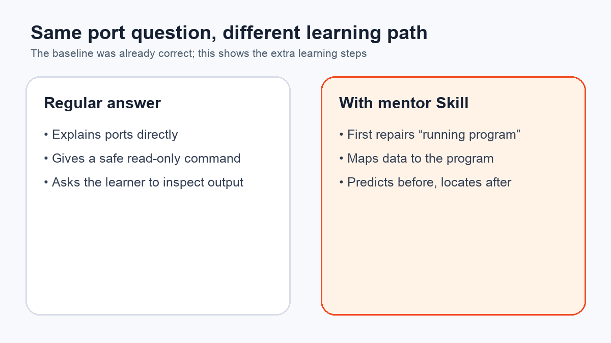
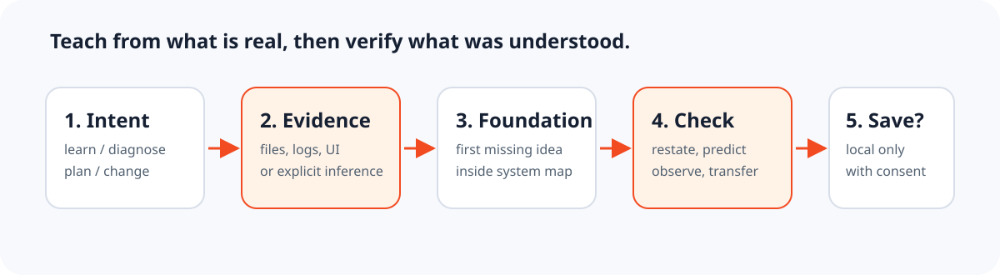

<div align="center">
  

# Grounded AI Mentor

**Learn computing and AI by tracing the real project in front of you—without hidden prerequisites or invented project details.**

[](https://github.com/weike-zhang/grounded-ai-mentor/releases)
[](https://github.com/weike-zhang/grounded-ai-mentor/actions/workflows/validate.yml)
[](LICENSE)

[简体中文](README.zh-CN.md) · [How it works](#how-it-works) · [Evidence](#evidence-status) · [Privacy](PRIVACY.md)

</div>

Grounded AI Mentor is an Agent Skill for people who are already building with AI but want to understand the computer science, software engineering and AI systems underneath their work. It finds the earliest missing concept, connects claims to authorized project evidence and checks whether the learner can use the idea before moving on.

## Install and try it

Install with the open Agent Skills CLI:

```bash
npx skills add weike-zhang/grounded-ai-mentor \
  --skill grounded-ai-mentor -g
```

Then ask your agent:

```text
Use $grounded-ai-mentor to explain what happens from clicking Login
to the database returning a result. Define every new term and cite
the project evidence behind each project-specific claim.
```

See [docs/INSTALL.md](docs/INSTALL.md) for manual Codex installation, validation, update and uninstall paths.

## What changes in a lesson



In the published pilot, the baseline was already accurate and safe. With the Skill, the response made four behaviors more explicit:

- name the earliest prerequisite before defining the requested term;
- show the compact end-to-end system path first;
- label generic examples instead of implying project evidence;
- ask for a prediction before a safe observation.

Read the [complete sanitized responses and limitations](evals/results/model-comparison.md). Each pair is a transparent example, not a benchmark or proof of learning gains.

A second read-only comparison uses a real release-bundle implementation, regression tests and a documented security failure. Both conditions were strong; the Skill made the system path more explicit but did not show a material accuracy advantage. Read the [project-grounded comparison](evals/results/project-grounded-comparison.md). Publishing this limitation is part of the evidence standard.

## How it works



1. Route the request as explanation, diagnosis, implementation or planning.
2. Start with existing evidence instead of an onboarding questionnaire.
3. Define the earliest missing prerequisite and place it in the system map.
4. Ground project claims in files, logs, UI state or explicit user statements.
5. Ask for one proportionate restate, prediction, observation or transfer check.
6. Save local learner state only with explicit consent.

The Skill does not turn a learning request into a code change, invent a plausible project stack or silently persist personal context.

## Evidence status

| Surface | Status | Evidence |
| --- | --- | --- |
| Skill structure | Verified | Skill validator and CI |
| Skills CLI discovery | Verified | Repository discovery on 2026-08-12 |
| Codex plugin manifest | Verified locally | Manifest validation |
| Live teaching behavior | Exploratory only | Two complete pairs; one uses exact project files |
| Other Agent Skills hosts | Unverified | Community compatibility reports welcome |

Run the release-integrity checks:

```bash
python evals/validate_fixtures.py
```

These checks validate fixture structure and required files. They deliberately do not output a model-quality percentage. See [evals/README.md](evals/README.md) for the planned repeated evaluation design.

## Privacy by architecture

The public repository contains fictional examples and a blank learner-profile template. A real profile may be created only with explicit consent at:

```text
.grounded-ai-mentor/learner-profile.md
```

That path is ignored by default. Learners can view, correct, export or delete their state. Scan a profile before persistence or a sharing review:

```bash
python skills/grounded-ai-mentor/scripts/validate_state.py \
  .grounded-ai-mentor/learner-profile.md
```

A clean scan reports structure and configured sensitive-data patterns. It does not grant permission to persist or share the profile; both actions still require the learner's explicit authorization.

Read [PRIVACY.md](PRIVACY.md) before enabling persistence.

## Repository map

```text
skills/grounded-ai-mentor/  installable Skill
examples/                   fictional teaching examples
evals/                      fixtures, rubric and transparent pilot output
assets/                     mascot, social preview and diagrams
docs/                       installation instructions
release/                    public release notes
```

## Contributing

The most useful contribution is a reproducible teaching failure: an undefined term, invented project evidence, premature action or a case where the learner still cannot transfer the idea. See [CONTRIBUTING.md](CONTRIBUTING.md).

## License and visual assets

Code and documentation use the [MIT License](LICENSE). The project author has confirmed the right to publish and redistribute the mascot as part of Grounded AI Mentor. Mascot-derived visuals are not separately licensed under MIT for reuse outside this project; see [assets/ASSET-NOTICE.md](assets/ASSET-NOTICE.md).

Built by [Weike Zhang](https://github.com/weike-zhang).
