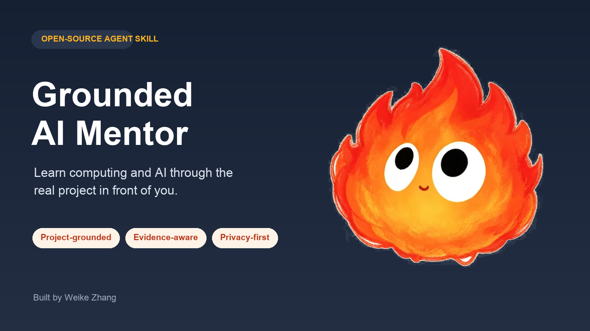

<div align="center">
  

# Grounded AI Mentor

**用你正在做的真实项目，逐层学懂计算机、软件工程与 AI。**

[English](README.md) · [工作原理](#工作原理) · [量化评估](#量化评估) · [隐私](PRIVACY.md)

</div>

Grounded AI Mentor 是一个不预设技术基础的 Agent Skill。它会找到最早缺失的概念，把概念放进完整系统，使用经过授权的真实项目证据建立关联，并在继续之前要求适度的理解证据。

它不是课程资料堆，也不是只负责直接给答案的聊天机器人，更不代表用户问解释时可以擅自修改项目。

## 它有什么不同

| 常见 AI 回答 | Grounded AI Mentor |
| --- | --- |
| 默认用户认识常用术语 | 每个新词都从无隐藏前提的定义开始 |
| 只解释孤立概念 | 放进“硬件—操作系统—网络—应用—数据—AI”地图 |
| 猜测概念与项目的关系 | 引用已授权文件、日志、命令结果、截图或用户陈述 |
| 讲完就认为学会 | 使用复述、预测、观察或迁移任务验证理解 |
| 静默保存个人上下文 | 只有得到同意才在本地保存学习状态 |

## 快速开始

把 `skills/grounded-ai-mentor/` 复制到支持 Agent Skills 的客户端目录，按客户端要求重启，然后输入：

```text
使用 $grounded-ai-mentor，从点击登录按钮开始，解释到数据库返回结果为止。
每个第一次出现的技术词都要先定义。
```

仓库也提供 Codex 的纯 Skill 插件外壳。详细安装方式见 [docs/INSTALL.zh-CN.md](docs/INSTALL.zh-CN.md)。Skill 本身不要求 API Key、后端或遥测。

## 可以这样使用

```text
使用 $grounded-ai-mentor，先帮助我理解这个项目，再决定是否修改。
```

```text
我不理解 API 是什么。请从用户点击开始解释到数据保存，
再给我一个不会修改生产环境的观察任务。
```

```text
使用 $grounded-ai-mentor 诊断这个错误。先看证据，
再教我导致错误的完整请求链路。
```

## 工作原理


1. 判断当前是学习、诊断、改动还是规划。
2. 先使用已有证据，不在开头启动长问卷。
3. 只有遇到真实决策节点时，才合并询问相关问题。
4. 找到最早缺失的前置概念，并放进系统地图。
5. 项目结论必须有证据，否则明确标为通用示例或推断。
6. 适度验证理解，只有获得同意才保存本地学习状态。

可以查看[基于项目的教学示例](examples/project-grounded-session.md)和[误解恢复示例](examples/misunderstanding-recovery.md)。

## 隐私架构

公开仓库只包含空白模板和虚构案例。如果学习者明确同意，真实学习状态保存在：

```text
.grounded-ai-mentor/learner-profile.md
```

这个目录默认被 Git 忽略。用户可以查看、纠正、导出和删除状态。分享前运行：

```bash
python skills/grounded-ai-mentor/scripts/validate_state.py \
  .grounded-ai-mentor/learner-profile.md
```

启用持久化前请阅读 [PRIVACY.md](PRIVACY.md)。

## 量化评估

评估包含应触发和不应触发的问题、多轮教学场景、隐私与授权案例，以及带 Skill / 不带 Skill 对照评分规则。

```bash
python evals/validate_dataset.py
```

公开分数必须同时提供原始问题、运行条件、模型、日期和限制。首版只评估可观察的教学行为，不宣称已经证明长期学习效果。详见 [evals/README.md](evals/README.md)。

## 兼容性

| 使用方式 | 状态 | 证据 |
| --- | --- | --- |
| Agent Skills 文件夹格式 | 已验证 | Skill 结构校验通过 |
| Codex 纯 Skill 插件 | 本地已验证 | 插件清单校验通过 |
| Codex 实际教学行为 | 已完成探索性对照 | 只有一组记录，不是基准测试 |
| Claude Code 等兼容客户端 | 未验证 | 欢迎社区验证 |

## 贡献与许可

最有价值的贡献是可复现的教学失败：没有定义的术语、编造的项目关系、过早执行的操作，或学习者仍无法迁移使用的案例。参见 [CONTRIBUTING.md](CONTRIBUTING.md)。

代码和文档使用 [MIT License](LICENSE)。火焰角色来自用户提供图片，在首次公开 Push 前仍需确认公开修改与再分发权利；当前视觉文件属于本地发布候选，不自动包含在 MIT 授权内。参见 [assets/ASSET-NOTICE.md](assets/ASSET-NOTICE.md)。

Built by [Weike Zhang](https://github.com/weike-zhang).
