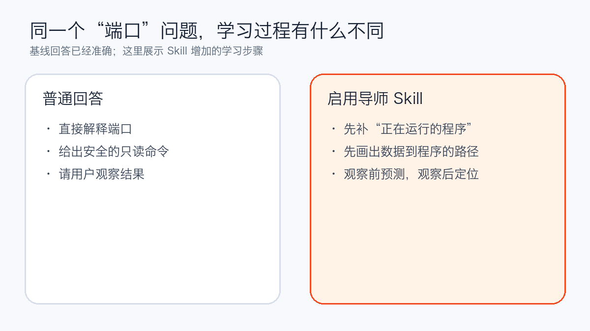
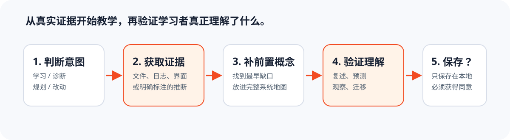

<div align="center">
  

# Grounded AI Mentor

**让 AI 不只替你把项目做出来，也把它真正讲明白。**

[English](README.md) · [安装试用](#安装后试一次) · [工作方式](#它怎样陪你学) · [证据与兼容性](#证据与兼容性) · [隐私](PRIVACY.md)

</div>

你已经能用 AI 写页面、接接口、部署服务，但一遇到报错或要改关键逻辑，还是不知道问题在哪里、改了会影响什么。

Grounded AI Mentor 是一个给 AI 项目实践者使用的导师 Skill。它会读取你明确允许查看的代码、日志和页面，从你第一次跟不上的概念讲起，把抽象术语对应到正在做的真实项目。

不能从项目中确认的地方，它会直接说明；不会拿一段通用答案冒充你的项目事实。

## 你是不是也卡在这里

- AI 生成的代码能运行，但自己不敢修改；
- 报错时只能不断把日志复制给 AI，不知道该看哪一段；
- API、端口、数据库、模型这些词都见过，却串不成完整过程；
- 看解释时觉得懂了，离开当前对话又不会判断；
- 想系统学习计算机与 AI，但不想放下手头项目，先学半年课程。

这个 Skill 不是让 AI 把答案写得更长，而是让它从你真正卡住的地方开始，陪你把眼前项目看懂一点、验证一点，再继续下一步。

## 它具体会怎么帮你

| 你遇到的情况 | Grounded AI Mentor 的做法 |
| --- | --- |
| 一个解释里连续出现很多陌生词 | 找到你第一次跟不上的概念，先补这一层，不继续堆术语 |
| 想知道某个功能到底怎么运行 | 从用户动作开始，沿代码、请求、服务和数据逐步追踪 |
| AI 说“你的项目应该是这样” | 指出结论来自哪个文件、日志、页面或你的明确陈述 |
| 当前材料不足以确认 | 明确标成通用知识或推测，不伪装成项目事实 |
| 听完感觉懂了，但还不会用 | 让你做一次安全的预测、观察或定位，确认自己能判断 |

它的目标不是让你背更多术语，而是帮助你逐渐做到：说清一个功能经过了哪些环节；知道遇到问题该去哪里找证据；分清已经确认的事实和暂时的推测；在修改前先做一次安全观察。

## 看一个公开案例

案例中的学习者已经听过“端口”的解释，但仍然不明白，于是提出：

```text
我还是不明白什么是端口。请不要换一个花哨比喻，
回到最早的前置概念并让我做一个安全观察。
```



普通回答本身已经准确、安全。启用 Skill 后，回答先补上“电脑会同时运行多个程序，收到的数据必须交给正确程序”这一层，再解释端口；运行只读命令前先让学习者预测，运行后再请他从结果中找出程序和端口。

你可以查看[完整的基线回答](evals/results/pilot/baseline-misunderstanding.md)、[启用 Skill 后的回答](evals/results/pilot/with-skill-misunderstanding.md)和[对照说明](evals/results/model-comparison.md)。这只是一组公开的探索性案例，不是基准测试，也不能证明长期学习效果。

第二组只读对照直接使用真实发布打包器、回归测试和已经记录的安全缺陷。两组回答都很强；启用 Skill 后系统路径更直观，但没有表现出实质性的准确性优势。完整材料见[真实项目证据对照](evals/results/project-grounded-comparison.md)。如实公开这个限制也是证据标准的一部分。

## 安装后试一次

使用 Agent Skills CLI 安装：

```bash
npx skills add weike-zhang/grounded-ai-mentor \
  --skill grounded-ai-mentor -g
```

然后把下面这段话交给支持 Agent Skills 的客户端：

```text
使用 $grounded-ai-mentor 帮我看懂这个项目。

请从“用户点击登录”开始，告诉我数据经过了哪些地方。
第一次出现的技术词，先解释它是什么、解决什么问题。
结合项目时请指出依据；先不要修改代码。
```

Codex 手动安装、校验、更新和卸载方式见 [docs/INSTALL.zh-CN.md](docs/INSTALL.zh-CN.md)。

## 它怎样陪你学

1. 先判断你现在要的是理解、诊断、修改还是学习规划，不把“给我讲明白”擅自变成改代码。
2. 先利用你已经提供的材料开始解释，不在开头让你填写一整套技术背景问卷。
3. 找到你第一次跟不上的概念，把它放回“硬件—操作系统—网络—应用—数据—AI”的完整路径。
4. 涉及真实项目时，引用文件、日志、界面状态或你的明确陈述；证据不足就如实说明。
5. 对重要内容安排一次适度的复述、预测、观察或迁移练习，不把“听过”当成“会用”。
6. 只有得到明确同意，才会在本地保存学习状态。



## 它不会替你做的决定

- 不会因为你想学习，就擅自修改项目或生产环境；
- 不会编造看起来合理的技术栈、文件关系、用户或业务结果；
- 不会把通用示例写成已经在你项目中确认的事实；
- 不会未经同意保存个人学习信息。

## 证据与兼容性

[](https://github.com/weike-zhang/grounded-ai-mentor/releases)
[](https://github.com/weike-zhang/grounded-ai-mentor/actions/workflows/validate.yml)
[](LICENSE)

| 使用方式 | 状态 | 证据 |
| --- | --- | --- |
| Skill 结构 | 已验证 | Skill 验证器和 CI |
| Skills CLI 发现 | 已验证 | 2026-08-12 在线发现仓库中的 Skill |
| Codex 插件清单 | 本地已验证 | 清单校验通过 |
| 实际教学行为 | 仅探索性案例 | 两组完整对照，其中一组使用真实项目文件 |
| 其他 Agent Skills 客户端 | 未验证 | 欢迎提交兼容性报告 |

运行发布材料完整性检查：

```bash
python evals/validate_fixtures.py
```

这项检查只验证夹具结构和必要文件，不输出模型能力百分比。重复运行方案见 [evals/README.md](evals/README.md)。

## 隐私

公开仓库不包含用户的私有项目或真实学习画像；示例使用虚构材料，评估只引用可公开的仓库文件。只有得到你的明确同意，Skill 才可以在当前项目中创建：

```text
.grounded-ai-mentor/learner-profile.md
```

该目录默认被 Git 忽略。你可以随时查看、纠正、导出或删除其中的内容。持久化或评估是否可分享之前运行：

```bash
python skills/grounded-ai-mentor/scripts/validate_state.py \
  .grounded-ai-mentor/learner-profile.md
```

扫描通过只表示结构有效、且没有命中已配置的敏感信息规则；它不代表已经获得持久化或分享授权，这两个动作仍需学习者明确同意。

启用学习状态保存前，请阅读 [PRIVACY.md](PRIVACY.md)。

## 贡献与许可

最有价值的贡献是可复现的教学失败：哪个词没有定义、哪段项目关系被编造、哪次操作执行得太早，或者解释结束后学习者仍然不会判断。参见 [CONTRIBUTING.md](CONTRIBUTING.md)。

代码和文档使用 [MIT License](LICENSE)。项目作者已经确认火焰角色可以作为 Grounded AI Mentor 的一部分公开和再分发；角色衍生视觉不随 MIT 许可单独授权给项目外使用。详见 [assets/ASSET-NOTICE.md](assets/ASSET-NOTICE.md)。

Built by [Weike Zhang](https://github.com/weike-zhang)。
